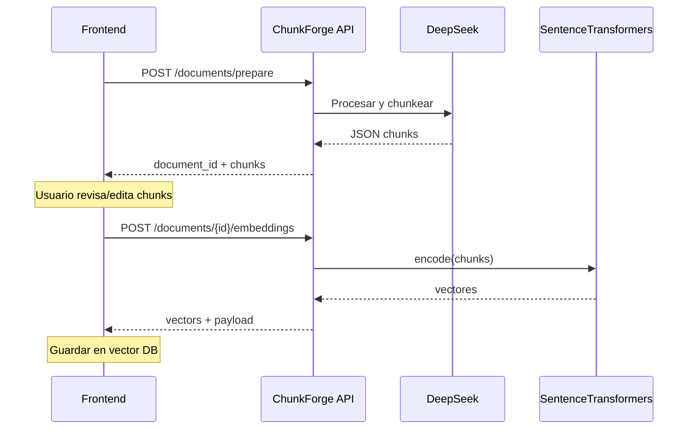

# ChunkForge API — Documentación de endpoints

API REST para preparar documentos (chunking semántico con DeepSeek) y generar embeddings locales listos para almacenar en una base de datos vectorial.

**Base URL:** `http://localhost:8000`  
**Prefijo API:** `/api/v1`  
**Documentación interactiva:** [Swagger UI](http://localhost:8000/docs) · [ReDoc](http://localhost:8000/redoc)  
**Guía para el equipo frontend:** [FRONTEND.md](./FRONTEND.md)

---

## Flujo recomendado



1. **Prepare** — Sube un documento o texto; la API devuelve chunks estructurados y un `document_id`.
2. **Revisión** — El frontend edita/aprueba los chunks (fuera de esta API).
3. **Embeddings** — Envía los chunks aprobados; la API devuelve vectores y payloads para Qdrant, Pinecone, etc.

---

## Variables de entorno

| Variable | Requerida | Descripción |
|----------|-----------|-------------|
| `DEEPSEEK_API_KEY` | Sí | API key de [DeepSeek](https://platform.deepseek.com/api_keys) |
| `DEEPSEEK_MODEL` | Sí | Modelo chat (ej. `deepseek-chat`, `deepseek-v4-flash`) |
| `EMBEDDING_MODEL` | No | Modelo sentence-transformers (default: `sentence-transformers/paraphrase-multilingual-MiniLM-L12-v2`) |
| `MAX_UPLOAD_BYTES` | No | Tamaño máximo de archivo (default: 10 MB) |
| `MAX_CHARS_PER_SEGMENT` | No | Umbral para dividir documentos largos (default: 30000) |

---

## Endpoints

### 1. Preparar documento

Limpia, estructura y divide un documento en chunks semánticos usando DeepSeek.

| | |
|---|---|
| **Método** | `POST` |
| **Ruta** | `/api/v1/documents/prepare` |
| **Content-Type** | `multipart/form-data` |

#### Parámetros (form)

| Campo | Tipo | Requerido | Default | Descripción |
|-------|------|-----------|---------|-------------|
| `file` | archivo | uno de dos | — | PDF, DOCX o TXT |
| `text` | string | uno de dos | — | Texto directo (sin archivo) |
| `mode` | string | No | `semantic` | Modo de chunking (solo `semantic` en v1) |
| `language` | string | No | `es` | Idioma del documento (se usa en el prompt) |
| `filename` | string | No | `inline.txt` | Nombre lógico cuando se usa `text` |

**Reglas:**
- Debe enviarse **solo** `file` **o** `text`, nunca ambos.
- Formatos de archivo: `.pdf`, `.docx`, `.txt` (no `.doc` legacy).

#### Respuesta `200 OK`

```json
{
  "document_id": "doc_a1b2c3d4e5f6",
  "filename": "manual.pdf",
  "status": "prepared",
  "document_title": "Manual de usuario",
  "document_summary": "Resumen del documento...",
  "chunks": [
    {
      "chunk_id": "chunk_001",
      "section": "Métodos de pago",
      "semantic_summary": "Explica los medios de pago aceptados.",
      "keywords": ["pagos", "transferencia", "efectivo"],
      "content": "El negocio acepta pagos por transferencia y efectivo.",
      "suggested_embedding_text": "Métodos de pago aceptados: transferencia y efectivo."
    }
  ]
}
```

#### Errores

| Código | Causa |
|--------|--------|
| `400` | Sin `file` ni `text`, o ambos a la vez |
| `400` | Extensión de archivo no soportada |
| `413` | Archivo supera `MAX_UPLOAD_BYTES` |
| `422` | Archivo vacío o sin texto extraíble |
| `422` | `mode` distinto de `semantic` |
| `502` | Error de DeepSeek o JSON inválido tras reintentos |

#### Ejemplo cURL — archivo

```bash
curl -X POST "http://localhost:8000/api/v1/documents/prepare" \
  -F "file=@manual.pdf" \
  -F "mode=semantic" \
  -F "language=es"
```

#### Ejemplo cURL — texto

```bash
curl -X POST "http://localhost:8000/api/v1/documents/prepare" \
  -F "text=El negocio acepta pagos por transferencia y efectivo." \
  -F "mode=semantic" \
  -F "language=es" \
  -F "filename=notas.txt"
```

---

### 2. Generar embeddings

Genera vectores localmente a partir de chunks ya revisados/aprobados por el frontend.

| | |
|---|---|
| **Método** | `POST` |
| **Ruta** | `/api/v1/documents/{document_id}/embeddings` |
| **Content-Type** | `application/json` |

#### Path

| Parámetro | Descripción |
|-----------|-------------|
| `document_id` | ID devuelto por `/prepare` (ej. `doc_a1b2c3d4e5f6`). No se valida en BD; se devuelve en la respuesta. |

#### Body (JSON)

```json
{
  "embedding_model": "sentence-transformers/paraphrase-multilingual-MiniLM-L12-v2",
  "source": "manual.pdf",
  "chunks": [
    {
      "chunk_id": "chunk_001",
      "text": "Métodos de pago aceptados: transferencia y efectivo.",
      "metadata": {
        "section": "Pagos",
        "keywords": ["pagos", "transferencia", "efectivo"]
      }
    },
    {
      "chunk_id": "chunk_002",
      "text": "Horario de atención de lunes a sábado de 8 AM a 10 PM.",
      "metadata": {
        "section": "Horarios",
        "keywords": ["horarios", "atención"]
      }
    }
  ]
}
```

| Campo | Tipo | Requerido | Descripción |
|-------|------|-----------|-------------|
| `chunks` | array | Sí | Mínimo 1 chunk; `chunk_id` únicos |
| `chunks[].chunk_id` | string | Sí | Identificador del chunk |
| `chunks[].text` | string | Sí | Texto a embeber (usar `suggested_embedding_text` o `content` de `/prepare`) |
| `chunks[].metadata` | object | No | `section` (string), `keywords` (array) |
| `source` | string | No | Origen del documento (ej. nombre del PDF); va al `payload` de cada vector |
| `embedding_model` | string | No | Si se envía, debe coincidir con `EMBEDDING_MODEL` del servidor |

#### Respuesta `200 OK`

```json
{
  "document_id": "doc_a1b2c3d4e5f6",
  "embedding_model": "sentence-transformers/paraphrase-multilingual-MiniLM-L12-v2",
  "dimensions": 384,
  "total_chunks": 2,
  "vectors": [
    {
      "chunk_id": "chunk_001",
      "vector": [0.123, -0.551, 0.991],
      "payload": {
        "text": "Métodos de pago aceptados: transferencia y efectivo.",
        "section": "Pagos",
        "keywords": ["pagos", "transferencia", "efectivo"],
        "source": "manual.pdf"
      }
    }
  ]
}
```

Los vectores están **normalizados** (adecuados para similitud coseno).

#### Errores

| Código | Causa |
|--------|--------|
| `422` | `chunks` vacío, `text` vacío, `chunk_id` duplicados |
| `422` | `embedding_model` no coincide con el configurado en `.env` |
| `500` | Fallo al cargar el modelo o al generar embeddings |

#### Ejemplo cURL

```bash
curl -X POST "http://localhost:8000/api/v1/documents/doc_a1b2c3d4e5f6/embeddings" \
  -H "Content-Type: application/json" \
  -d '{
    "source": "manual.pdf",
    "chunks": [
      {
        "chunk_id": "chunk_001",
        "text": "Métodos de pago aceptados: transferencia y efectivo.",
        "metadata": {
          "section": "Pagos",
          "keywords": ["pagos", "transferencia", "efectivo"]
        }
      }
    ]
  }'
```

---

## Mapeo prepare → embeddings

Tras `/prepare`, transforma cada chunk para el endpoint de embeddings:

| Campo prepare | Campo embeddings |
|---------------|------------------|
| `chunk_id` | `chunk_id` |
| `suggested_embedding_text` (recomendado) o `content` | `text` |
| `section` | `metadata.section` |
| `keywords` | `metadata.keywords` |
| `filename` de la respuesta prepare | `source` (raíz del body) |
| `document_id` | path `{document_id}` |

---

## Iniciar el servidor

```powershell
.\.venv\Scripts\Activate.ps1
uvicorn app.main:app --reload --host 0.0.0.0 --port 8000
```

Con Docker:

```powershell
docker compose up --build
```

**Nota:** La primera petición a `/embeddings` puede tardar si el modelo aún no está en caché (descarga ~470 MB). El arranque intenta precargar el modelo en background.

---

## Colección Postman

Importa los archivos en la carpeta [`postman/`](../postman/):

- `ChunkForge-API.postman_collection.json` — requests de ejemplo
- `ChunkForge-API.local.postman_environment.json` — variables `base_url` y `document_id`

Tras ejecutar **Prepare Document (file)** o **(text)**, copia `document_id` de la respuesta a la variable de entorno `document_id` para probar **Generate Embeddings**.
