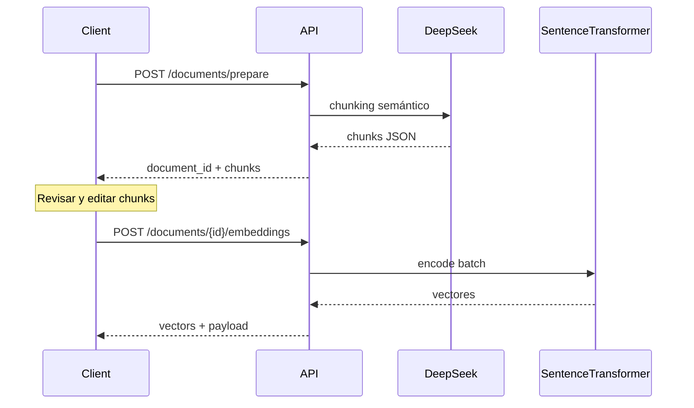
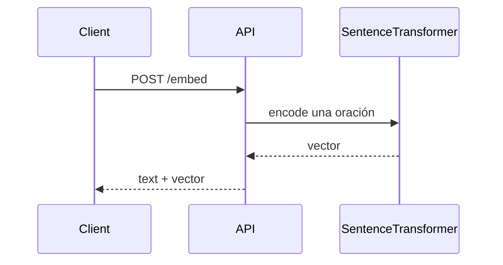

# ChunkForge API — Documentación de endpoints

Referencia canónica de los **3 endpoints** de la API v1.

| # | Método | Ruta | Uso |
|---|--------|------|-----|
| 1 | `POST` | `/api/v1/documents/prepare` | Subir documento → chunks semánticos (DeepSeek) |
| 2 | `POST` | `/api/v1/documents/{document_id}/embeddings` | Chunks aprobados → vectores + payload |
| 3 | `POST` | `/api/v1/embed` | Una oración → un vector |

**Base URL (desarrollo):** `http://localhost:8000`  
**Health check:** `GET /`  
**Swagger:** `/docs` · **OpenAPI:** `/openapi.json`  
**Guía frontend:** [FRONTEND.md](./FRONTEND.md)

---

## Introducción

- **Autenticación:** ninguna en v1.
- **CORS:** configurable con `CORS_ORIGINS` en `.env` (separados por coma). Default: `http://localhost:5173`, `http://8.233.222.241`.
- **Embeddings:** modelo fijo en `EMBEDDING_MODEL` (sentence-transformers). Vectores normalizados, 384 dimensiones.

### Health check — `GET /`

```json
{
  "service": "ChunkForge API",
  "status": "ok",
  "message": "La API está funcionando correctamente.",
  "version": "0.1.0",
  "docs": "/docs",
  "api": "/api/v1"
}
```

---

## Flujos

### Flujo documentos (RAG)



### Flujo embed directo



Usar **embed directo** para: consultas de búsqueda en vivo, pruebas, o embeber una sola frase sin pasar por prepare.

---

## Endpoint 1 — Preparar documento

Convierte un documento en chunks listos para revisión y posterior embedding.

| | |
|---|---|
| **Método** | `POST` |
| **Ruta** | `/api/v1/documents/prepare` |
| **Content-Type** | `multipart/form-data` |

### Request (form)

| Campo | Tipo | Requerido | Default | Descripción |
|-------|------|-----------|---------|-------------|
| `file` | archivo | uno de dos | — | `.pdf`, `.docx`, `.txt` |
| `text` | string | uno de dos | — | Texto sin archivo |
| `mode` | string | No | `semantic` | Solo `semantic` en v1 |
| `language` | string | No | `es` | Idioma para el prompt |
| `filename` | string | No | `inline.txt` | Nombre lógico si usas `text` |

**Reglas:** solo `file` **o** `text`, nunca ambos.

### Response `200`

```json
{
  "document_id": "doc_a1b2c3d4e5f6",
  "filename": "manual.pdf",
  "status": "prepared",
  "document_title": "Manual de usuario",
  "document_summary": "Resumen del documento...",
  "chunks": [
    {
      "chunk_id": "chunk_001",
      "section": "Métodos de pago",
      "semantic_summary": "Explica los medios de pago aceptados.",
      "keywords": ["pagos", "transferencia", "efectivo"],
      "content": "El negocio acepta pagos por transferencia y efectivo.",
      "suggested_embedding_text": "Métodos de pago aceptados: transferencia y efectivo."
    }
  ]
}
```

### Errores

| HTTP | Causa |
|------|--------|
| 400 | Sin input o file+text a la vez / formato no soportado |
| 413 | Archivo > `MAX_UPLOAD_BYTES` |
| 422 | Sin texto extraíble / `mode` inválido |
| 502 | Error DeepSeek |

### cURL

```bash
curl -X POST "http://localhost:8000/api/v1/documents/prepare" \
  -F "file=@manual.pdf" \
  -F "mode=semantic" \
  -F "language=es"
```

---

## Endpoint 2 — Embeddings de documento

Genera vectores para chunks ya aprobados (tras revisión en el frontend).

| | |
|---|---|
| **Método** | `POST` |
| **Ruta** | `/api/v1/documents/{document_id}/embeddings` |
| **Content-Type** | `application/json` |

### Path

| Parámetro | Descripción |
|-----------|-------------|
| `document_id` | ID de `/prepare` (ej. `doc_abc123`). No se valida en BD. |

### Request body

```json
{
  "source": "manual.pdf",
  "chunks": [
    {
      "chunk_id": "chunk_001",
      "text": "Métodos de pago aceptados: transferencia y efectivo.",
      "metadata": {
        "section": "Pagos",
        "keywords": ["pagos", "transferencia", "efectivo"]
      }
    }
  ]
}
```

| Campo | Requerido | Descripción |
|-------|-----------|-------------|
| `chunks` | Sí | Min. 1; `chunk_id` únicos; `text` no vacío |
| `chunks[].metadata.section` | No | Título de sección |
| `chunks[].metadata.keywords` | No | Array de strings |
| `source` | No | Origen (ej. filename); va al `payload` de cada vector |
| `embedding_model` | No | Debe coincidir con `.env` si se envía |

### Response `200`

```json
{
  "document_id": "doc_a1b2c3d4e5f6",
  "embedding_model": "sentence-transformers/paraphrase-multilingual-MiniLM-L12-v2",
  "dimensions": 384,
  "total_chunks": 2,
  "vectors": [
    {
      "chunk_id": "chunk_001",
      "vector": [0.123, -0.551, 0.991],
      "payload": {
        "text": "Métodos de pago aceptados: transferencia y efectivo.",
        "section": "Pagos",
        "keywords": ["pagos", "transferencia", "efectivo"],
        "source": "manual.pdf"
      }
    }
  ]
}
```

### Mapeo desde `/prepare`

| Prepare | Embeddings |
|---------|------------|
| `chunk_id` | `chunk_id` |
| `suggested_embedding_text` (recomendado) | `text` |
| `section` | `metadata.section` |
| `keywords` | `metadata.keywords` |
| `filename` | `source` |
| `document_id` | path `{document_id}` |

### Errores

| HTTP | Causa |
|------|--------|
| 422 | Chunks vacíos, texto vacío, IDs duplicados, modelo inválido |
| 500 | Fallo al cargar modelo o encode |

### cURL

```bash
curl -X POST "http://localhost:8000/api/v1/documents/doc_abc123/embeddings" \
  -H "Content-Type: application/json" \
  -d '{"source":"manual.pdf","chunks":[{"chunk_id":"chunk_001","text":"Métodos de pago...","metadata":{"section":"Pagos","keywords":["pagos"]}}]}'
```

---

## Endpoint 3 — Embed texto (oración)

Convierte **una oración o frase** en un único vector. No requiere `document_id` ni flujo prepare.

| | |
|---|---|
| **Método** | `POST` |
| **Ruta** | `/api/v1/embed` |
| **Content-Type** | `application/json` |

### Request body

```json
{
  "text": "Horario de atención de lunes a sábado de 8 AM a 10 PM.",
  "embedding_model": null
}
```

| Campo | Requerido | Descripción |
|-------|-----------|-------------|
| `text` | Sí | Oración o frase; no vacía (trim) |
| `embedding_model` | No | Debe coincidir con `.env` si se envía |

### Response `200`

```json
{
  "embedding_model": "sentence-transformers/paraphrase-multilingual-MiniLM-L12-v2",
  "dimensions": 384,
  "text": "Horario de atención de lunes a sábado de 8 AM a 10 PM.",
  "vector": [0.442, -0.112, 0.771]
}
```

### Errores

| HTTP | Causa |
|------|--------|
| 422 | `text` vacío / `embedding_model` no coincide |
| 500 | Fallo modelo o encode |

### cURL

```bash
curl -X POST "http://localhost:8000/api/v1/embed" \
  -H "Content-Type: application/json" \
  -d '{"text": "Métodos de pago aceptados: transferencia y efectivo."}'
```

---

## Tabla de errores HTTP (resumen)

| HTTP | Endpoints | Significado típico |
|------|-----------|-------------------|
| 400 | prepare | Input inválido (file/text) o formato no soportado |
| 413 | prepare | Archivo demasiado grande |
| 422 | prepare, embeddings, embed | Validación de body/form |
| 500 | embeddings, embed | Error interno del modelo |
| 502 | prepare | Error DeepSeek |

---

## Variables de entorno

| Variable | Requerida | Default / notas |
|----------|-----------|-------------------|
| `DEEPSEEK_API_KEY` | Sí | — |
| `DEEPSEEK_MODEL` | Sí | `deepseek-chat` |
| `EMBEDDING_MODEL` | No | `sentence-transformers/paraphrase-multilingual-MiniLM-L12-v2` |
| `CORS_ORIGINS` | No | `http://localhost:5173,http://8.233.222.241` |
| `MAX_UPLOAD_BYTES` | No | 10485760 (10 MB) |

---

## Postman

Importar desde [`postman/`](../postman/):

- `ChunkForge-API.postman_collection.json`
- `ChunkForge-API.local.postman_environment.json`

Requests: Prepare (file/text), Generate Embeddings, **Embed Text (sentence)**.

---

## Iniciar servidor

```powershell
uvicorn app.main:app --reload --host 0.0.0.0 --port 8000
```
