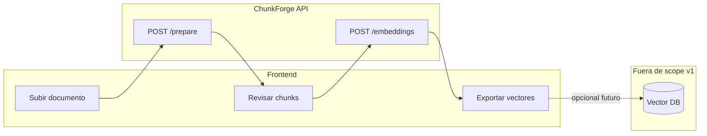
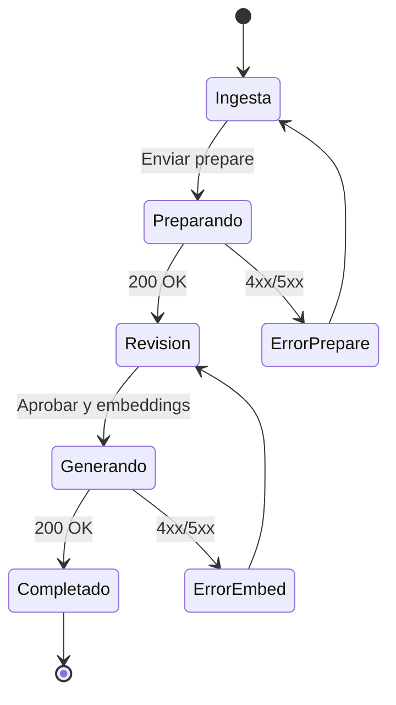

# ChunkForge — Guía para el equipo Frontend

Documentación orientada al desarrollo de la aplicación web que consume **ChunkForge API**. Describe la funcionalidad del producto, el diseño de pantallas, el flujo de usuario y la integración técnica con cada endpoint.

**API base (desarrollo):** `http://localhost:8000`  
**Prefijo:** `/api/v1`  
**Referencia técnica backend:** [API.md](./API.md) · [Swagger](http://localhost:8000/docs)

---

## 1. Qué es ChunkForge (visión del producto)

ChunkForge es una herramienta para **preparar documentos para RAG** (Retrieval-Augmented Generation):

1. El usuario sube un documento (PDF, Word, TXT) o pega texto.
2. La API limpia el contenido, lo estructura y lo divide en **chunks semánticos** (con metadatos).
3. El usuario **revisa, edita y aprueba** esos chunks en la interfaz.
4. La API genera **embeddings** (vectores de 384 dimensiones) listos para guardar en una base vectorial (Qdrant, Pinecone, Weaviate, etc.).

El frontend **no** llama a DeepSeek ni carga modelos de embeddings: solo consume la API REST.



---

## 2. Funcionalidad que debe tener el frontend

### 2.1 Obligatoria (MVP)

| # | Funcionalidad | Descripción |
|---|---------------|-------------|
| F1 | **Ingesta de documento** | Subir archivo (PDF/DOCX/TXT) o pegar texto; elegir idioma (`es` por defecto). |
| F2 | **Preparación** | Llamar a `POST /documents/prepare` y mostrar progreso (operación lenta, 10s–2min). |
| F3 | **Vista de documento preparado** | Mostrar `document_title`, `document_summary`, `document_id`, `filename`. |
| F4 | **Lista editable de chunks** | Tabla o cards con todos los campos del chunk; permitir editar antes de continuar. |
| F5 | **Validación local de chunks** | No permitir avanzar si hay `text` vacío, `chunk_id` duplicados o lista vacía. |
| F6 | **Generación de embeddings** | Llamar a `POST /documents/{id}/embeddings` con chunks aprobados. |
| F7 | **Resultado de embeddings** | Mostrar resumen (`dimensions`, `total_chunks`) y opción de descargar JSON. |
| F8 | **Manejo de errores** | Mensajes claros según código HTTP (400, 413, 422, 502, 500). |

### 2.2 Recomendada (mejor UX)

| # | Funcionalidad | Descripción |
|---|---------------|-------------|
| F9 | **Wizard por pasos** | Paso 1 Subir → Paso 2 Revisar → Paso 3 Embeddings → Paso 4 Exportar. |
| F10 | **Persistencia en sesión** | `sessionStorage` o estado global para no perder ediciones al recargar (mismo tab). |
| F11 | **Reordenar / eliminar chunks** | El usuario puede quitar chunks irrelevantes o cambiar orden visual (regenerar `chunk_id` secuencial al enviar). |
| F12 | **Toggle texto para embedding** | Elegir por chunk: usar `suggested_embedding_text` (default) o `content` (más largo). |
| F13 | **Vista previa del payload** | Antes de embeddings, mostrar JSON que se enviará a la API. |
| F14 | **Copiar / descargar** | Copiar `document_id`, descargar respuesta de prepare y de embeddings como `.json`. |

### 2.3 Fuera de alcance en v1 (no implementar aún)

- Login / multi-usuario.
- Guardar documentos en base de datos del backend (la API no persiste).
- Subir vectores directamente a Qdrant desde el front (solo recibir JSON; integración vector DB es fase posterior).
- Modos de chunking distintos de `semantic` (la API solo acepta `semantic`).

---

## 3. Flujo de usuario (user journey)



| Paso | Acción del usuario | Llamada API | Estado UI |
|------|-------------------|-------------|-----------|
| 1 | Sube archivo o pega texto, elige idioma | — | `idle` |
| 2 | Clic en «Preparar documento» | `POST /prepare` | `preparing` (spinner + texto «Procesando con IA…») |
| 3 | Revisa título, resumen y chunks | — | `review` |
| 4 | Edita chunks, elimina los que no sirvan | — | `review` (dirty) |
| 5 | Clic en «Generar embeddings» | `POST /embeddings` | `embedding` (spinner; puede tardar 5–30s) |
| 6 | Ve vectores y exporta JSON | — | `done` |

---

## 4. Diseño de interfaz (pantallas y componentes)

### 4.1 Principios de diseño

- **Claridad del pipeline:** el usuario siempre debe ver en qué paso está (1/4, 2/4, etc.).
- **Operaciones lentas visibles:** prepare y embeddings pueden tardar; usar skeleton, barra de progreso indeterminada y mensaje de que no cierre la pestaña.
- **Edición explícita:** dejar claro que los chunks son **borrador** hasta que el usuario los aprueba.
- **Datos técnicos accesibles pero no invasivos:** `document_id` y dimensiones en zona secundaria (collapsible o tooltip).

### 4.2 Layout general

```
┌─────────────────────────────────────────────────────────────┐
│  ChunkForge                    [Paso 2 de 4: Revisar]        │
├─────────────────────────────────────────────────────────────┤
│  ● Subir  ───  ● Revisar  ───  ○ Embeddings  ───  ○ Listo  │
├─────────────────────────────────────────────────────────────┤
│                                                             │
│                    [ Contenido del paso ]                   │
│                                                             │
└─────────────────────────────────────────────────────────────┘
```

- Header: logo + nombre del paso actual.
- Stepper horizontal (4 pasos): Subir → Revisar → Embeddings → Exportar.
- Área principal: un paso visible a la vez (wizard), con navegación «Atrás» / «Continuar» donde aplique.

---

### 4.3 Pantalla 1 — Subir documento (Ingesta)

**Objetivo:** capturar el documento y parámetros para `/prepare`.

**Componentes:**

| Componente | Comportamiento |
|------------|----------------|
| **Tabs o toggle** | «Archivo» \| «Texto plano» (mutuamente excluyentes, alineado con la API). |
| **Zona drag & drop** | Aceptar `.pdf`, `.docx`, `.txt`. Mostrar nombre y tamaño. Validar máx. 10 MB en cliente antes de subir. |
| **Textarea** | Visible solo en modo texto; placeholder con ejemplo. |
| **Select idioma** | Opciones: `es`, `en`, … (enviar como `language` en form). Default: `es`. |
| **Info modo** | Badge fijo: «Modo: semántico» (`mode=semantic`, no editable en v1). |
| **Botón primario** | «Preparar documento» → dispara prepare. Deshabilitado si no hay archivo ni texto. |

**Estados:**

- `idle`: formulario habilitado.
- `preparing`: formulario deshabilitado, overlay con spinner y «Analizando documento… puede tardar varios minutos».
- `error`: banner rojo con `detail` del API; botón «Reintentar».

**Wireframe:**

```
┌──────────────────────────────────────────┐
│  Subir documento                         │
├──────────────────────────────────────────┤
│  [ Archivo ]  [ Texto ]                  │
│  ┌────────────────────────────────────┐  │
│  │  Arrastra PDF, DOCX o TXT          │  │
│  │  o haz clic para seleccionar       │  │
│  └────────────────────────────────────┘  │
│  Idioma: [ Español (es) ▼ ]              │
│  Modo: semántico                         │
│                                          │
│              [ Preparar documento ]      │
└──────────────────────────────────────────┘
```

---

### 4.4 Pantalla 2 — Revisar chunks

**Objetivo:** mostrar resultado de `/prepare` y permitir edición antes de embeddings.

**Bloque superior — resumen del documento (solo lectura inicial, título editable opcional):**

| Campo API | UI |
|-----------|-----|
| `document_title` | Input o heading editable |
| `document_summary` | Textarea readonly o editable (si editas, no se reenvía a API en v1; solo visual) |
| `filename` | Subtítulo: «Archivo: manual.pdf» |
| `document_id` | Chip copiable + tooltip «Conservar para embeddings» |

**Lista de chunks — una card por chunk:**

```
┌─ chunk_001 ─────────────────────── [ Eliminar ] ─┐
│  Sección:      [ Métodos de pago          ]     │
│  Resumen:      [ Explica medios de pago... ]     │
│  Palabras clave: [ pagos ] [ transferencia ] [+] │
│  Contenido:    [ textarea multilínea        ]     │
│  Texto embedding: ○ Sugerido  ○ Contenido completo │
│                  [ textarea o preview         ]     │
└──────────────────────────────────────────────────┘
```

| Campo API | Campo en UI | Editable |
|-----------|-------------|----------|
| `chunk_id` | Etiqueta (regenerar si el usuario elimina/reordena) | No directo (auto) |
| `section` | Input | Sí |
| `semantic_summary` | Input corto | Sí |
| `keywords` | Tags input (chips) | Sí |
| `content` | Textarea | Sí |
| `suggested_embedding_text` | Textarea o radio vs content | Sí |

**Reglas de UI:**

- Botón «Añadir chunk» opcional: crea `chunk_NNN` nuevo con campos vacíos (validar antes de embed).
- «Eliminar» quita el chunk de la lista (confirmación ligera).
- Contador: «12 chunks» visible en header del paso.
- Botón secundario: «Vista previa JSON» (modal con body que se enviará a embeddings).
- Botón primario: «Generar embeddings» → validar y llamar API.

**Validaciones antes de continuar:**

```text
✓ Al menos 1 chunk
✓ Cada chunk tiene text (embedding) no vacío
✓ chunk_id únicos
✓ Ningún keyword vacío si se desea (opcional: filtrar strings vacíos)
```

---

### 4.5 Pantalla 3 — Generando embeddings

Pantalla intermedia o overlay mientras corre `POST /embeddings`:

- Mensaje: «Generando vectores (384 dimensiones)…»
- No permitir doble submit.
- Timeout visual a los 60s con mensaje «Sigue procesando, el modelo puede estar cargando».

---

### 4.6 Pantalla 4 — Resultado / Exportar

**Objetivo:** mostrar éxito y entregar datos al usuario o al siguiente sistema.

**Resumen (cards):**

| Dato | Origen |
|------|--------|
| Document ID | `document_id` |
| Modelo | `embedding_model` |
| Dimensiones | `dimensions` (384) |
| Total chunks | `total_chunks` |

**Tabla de vectores (vista resumida):**

| chunk_id | section | text (truncado) | vector preview |
|----------|---------|-----------------|----------------|
| chunk_001 | Pagos | Métodos de pago… | [0.12, -0.55, …] (primeros 3 valores) |

**Acciones:**

- **Descargar JSON completo** — respuesta íntegra de embeddings.
- **Copiar al portapapeles** — JSON formateado.
- **Nuevo documento** — reset del wizard.

**Nota para integración futura:** el JSON de `vectors` es el contrato para insertar en vector DB; cada item tiene `chunk_id`, `vector` (float[]) y `payload` para filtros en búsqueda.

---

## 5. Endpoints a consumir

### Resumen

| Paso | Método | URL | Content-Type |
|------|--------|-----|--------------|
| Preparar | `POST` | `/api/v1/documents/prepare` | `multipart/form-data` |
| Embeddings | `POST` | `/api/v1/documents/{document_id}/embeddings` | `application/json` |

### Variable de entorno en el front

```env
# .env.local (Next.js / Vite)
VITE_API_BASE_URL=http://localhost:8000
# o
NEXT_PUBLIC_API_BASE_URL=http://localhost:8000
```

Todas las URLs: `${API_BASE_URL}/api/v1/...`

---

### 5.1 POST `/documents/prepare`

**Cuándo:** al confirmar subida en pantalla 1.

**Request (FormData):**

```typescript
// Solo UNO de los dos:
formData.append("file", file);           // File object
// O
formData.append("text", plainText);
formData.append("filename", "notas.txt"); // solo si usas text

formData.append("mode", "semantic");
formData.append("language", "es");
```

**Ejemplo fetch (archivo):**

```typescript
async function prepareDocument(file: File, language: string) {
  const form = new FormData();
  form.append("file", file);
  form.append("mode", "semantic");
  form.append("language", language);

  const res = await fetch(`${API_BASE}/api/v1/documents/prepare`, {
    method: "POST",
    body: form,
  });

  if (!res.ok) {
    const err = await res.json().catch(() => ({}));
    throw new Error(err.detail ?? res.statusText);
  }

  return res.json() as PrepareDocumentResponse;
}
```

**Response — guardar en estado global:**

```typescript
interface PrepareDocumentResponse {
  document_id: string;
  filename: string;
  status: "prepared";
  document_title: string;
  document_summary: string;
  chunks: ChunkFromPrepare[];
}

interface ChunkFromPrepare {
  chunk_id: string;
  section: string;
  semantic_summary: string;
  keywords: string[];
  content: string;
  suggested_embedding_text: string;
}
```

**Errores a mostrar en UI:**

| HTTP | Mensaje sugerido al usuario |
|------|----------------------------|
| 400 | «Selecciona un archivo o escribe texto, no ambos.» / «Formato no soportado.» |
| 413 | «El archivo supera el tamaño máximo (10 MB).» |
| 422 | «No se pudo leer el documento. Prueba otro archivo.» |
| 502 | «Error al procesar con IA. Intenta de nuevo en unos minutos.» |

---

### 5.2 POST `/documents/{document_id}/embeddings`

**Cuándo:** usuario aprueba chunks en pantalla 2.

**Request — construir desde estado editado:**

```typescript
interface EmbedDocumentRequest {
  source?: string;           // usar prepare.filename
  embedding_model?: string;  // omitir en v1 (servidor usa .env)
  chunks: {
    chunk_id: string;
    text: string;
    metadata: {
      section: string;
      keywords: string[];
    };
  }[];
}
```

**Función de mapeo (prepare → embeddings):**

```typescript
function buildEmbedRequest(
  prepare: PrepareDocumentResponse,
  editedChunks: EditableChunk[],
): EmbedDocumentRequest {
  return {
    source: prepare.filename,
    chunks: editedChunks.map((c) => ({
      chunk_id: c.chunk_id,
      text: c.useSuggestedText
        ? c.suggested_embedding_text.trim()
        : c.content.trim(),
      metadata: {
        section: c.section,
        keywords: c.keywords.filter(Boolean),
      },
    })),
  };
}
```

**Ejemplo fetch:**

```typescript
async function generateEmbeddings(
  documentId: string,
  body: EmbedDocumentRequest,
) {
  const res = await fetch(
    `${API_BASE}/api/v1/documents/${documentId}/embeddings`,
    {
      method: "POST",
      headers: { "Content-Type": "application/json" },
      body: JSON.stringify(body),
    },
  );

  if (!res.ok) {
    const err = await res.json().catch(() => ({}));
    throw new Error(
      typeof err.detail === "string"
        ? err.detail
        : JSON.stringify(err.detail ?? err),
    );
  }

  return res.json() as EmbedDocumentResponse;
}
```

**Response:**

```typescript
interface EmbedDocumentResponse {
  document_id: string;
  embedding_model: string;
  dimensions: number;       // 384
  total_chunks: number;
  vectors: {
    chunk_id: string;
    vector: number[];         // length === dimensions
    payload: {
      text: string;
      section: string;
      keywords: string[];
      source: string | null;
    };
  }[];
}
```

**Errores:**

| HTTP | Mensaje sugerido |
|------|------------------|
| 422 | «Revisa los chunks: texto vacío o IDs duplicados.» |
| 500 | «Error al generar embeddings. Espera e intenta de nuevo.» |

---

## 6. Modelo de estado recomendado (React)

```typescript
type WizardStep = "upload" | "review" | "embedding" | "done";

interface AppState {
  step: WizardStep;
  language: string;

  // Tras prepare
  prepareResult: PrepareDocumentResponse | null;

  // Chunks editables (copia mutable de prepareResult.chunks)
  editableChunks: EditableChunk[];

  // Tras embeddings
  embedResult: EmbedDocumentResponse | null;

  loading: boolean;
  error: string | null;
}

interface EditableChunk extends ChunkFromPrepare {
  useSuggestedText: boolean; // default true
}
```

**Transiciones:**

- `upload` + prepare OK → `review` + llenar `editableChunks` desde `chunks`.
- `review` + embed OK → `done` + guardar `embedResult`.
- Error en cualquier paso → `error` + banner; no borrar `editableChunks` en error de embed.

---

## 7. Tipos TypeScript (archivo sugerido)

Crear en el proyecto front, por ejemplo `src/types/chunkforge.ts`:

```typescript
export interface ChunkFromPrepare {
  chunk_id: string;
  section: string;
  semantic_summary: string;
  keywords: string[];
  content: string;
  suggested_embedding_text: string;
}

export interface PrepareDocumentResponse {
  document_id: string;
  filename: string;
  status: string;
  document_title: string;
  document_summary: string;
  chunks: ChunkFromPrepare[];
}

export interface EmbedChunkInput {
  chunk_id: string;
  text: string;
  metadata: {
    section: string;
    keywords: string[];
  };
}

export interface EmbedDocumentRequest {
  chunks: EmbedChunkInput[];
  source?: string;
  embedding_model?: string;
}

export interface EmbedDocumentResponse {
  document_id: string;
  embedding_model: string;
  dimensions: number;
  total_chunks: number;
  vectors: Array<{
    chunk_id: string;
    vector: number[];
    payload: {
      text: string;
      section: string;
      keywords: string[];
      source: string | null;
    };
  }>;
}
```

---

## 8. CORS

El backend ya expone CORS configurable por `.env`:

```env
# Un origen
CORS_ORIGINS=http://localhost:5173

# Varios orígenes (separados por coma)
CORS_ORIGINS=http://localhost:5173,http://localhost:3000
```

Default si no se define: `http://localhost:5173`. Tras cambiar `.env`, reinicia uvicorn.

---

## 9. Tiempos de respuesta esperados (UX)

| Operación | Tiempo típico | Recomendación UI |
|-----------|---------------|------------------|
| Prepare (texto corto) | 15–60 s | Spinner + mensaje informativo |
| Prepare (PDF grande) | 1–3 min | Misma UI; considerar cancelación solo visual |
| Embeddings (1ª vez en servidor) | 10–60 s | «Cargando modelo…» en primer uso |
| Embeddings (siguientes) | 1–10 s | Spinner estándar |

No usar timeout de fetch menor a **120 s** en prepare.

---

## 10. Checklist de implementación para el front

- [ ] Wizard de 4 pasos con stepper
- [ ] Subida archivo + texto plano (exclusivos)
- [ ] Validación tamaño archivo ≤ 10 MB
- [ ] Integración `POST /prepare` con FormData
- [ ] Pantalla revisión con edición de todos los campos de chunk
- [ ] Toggle suggested_embedding_text vs content
- [ ] Validación local antes de embeddings
- [ ] Integración `POST /embeddings` con JSON
- [ ] Pantalla resultado + descarga JSON
- [ ] Manejo de errores HTTP con mensajes en español
- [ ] Variable `API_BASE_URL` configurable
- [ ] (Opcional) Persistencia en `sessionStorage` del borrador de chunks

---

## 11. Ejemplo de flujo completo (secuencia)

```text
1. Usuario sube manual.pdf, idioma es
2. POST /api/v1/documents/prepare
   → document_id: doc_abc123, 8 chunks
3. Usuario edita chunk_003, elimina chunk_007
4. Renumerar chunk_ids opcional: chunk_001..chunk_006
5. POST /api/v1/documents/doc_abc123/embeddings
   Body: { source: "manual.pdf", chunks: [...] }
   → dimensions: 384, 6 vectors
6. Usuario descarga chunkforge-embeddings-doc_abc123.json
7. (Futuro) Backend o script inserta vectors en Qdrant
```

---

## 12. Referencias

- [API.md](./API.md) — contrato HTTP detallado
- [postman/ChunkForge-API.postman_collection.json](../postman/ChunkForge-API.postman_collection.json) — ejemplos ejecutables
- OpenAPI en vivo: `GET /openapi.json` — generar cliente con Orval/OpenAPI Generator si se desea
